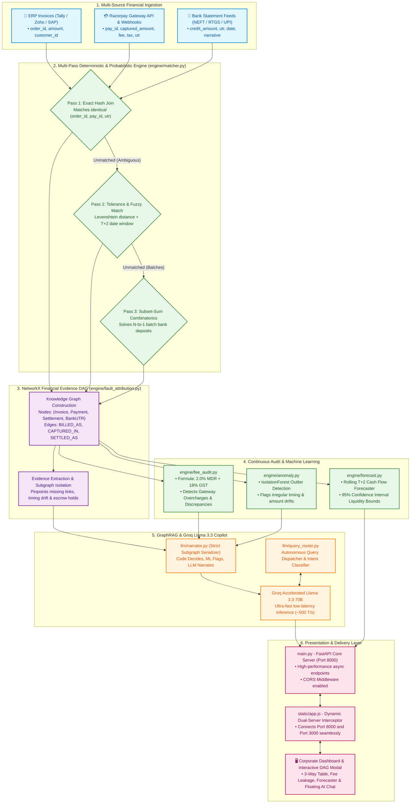

# 💳 AI Finance Controller & Multi-Source Reconciliation Agent
> **Razorpay /buildathon — Track 04: AI Finance Controller**  
> *"Run the books and the cash position"*

[](https://razorpay.com)
[](https://razorpay.com)
[](https://groq.com)
[](https://razorpay.com)
[](https://pytest.org)

---

## 📖 Table of Contents
1. [Executive Summary](#-executive-summary)
2. [The Core Problem (The "Why")](#-the-core-problem-the-why)
3. [Glossary of Terms (Plain English)](#-glossary-of-terms-plain-english)
4. [Comprehensive Architecture & Flow Diagram](#-comprehensive-architecture--flow-diagram)
5. [Architectural Challenges & Engineering Solutions Log](./ARCHITECTURAL_CHALLENGES_AND_SOLUTIONS.md)
6. [Phase-by-Phase Technical Implementation](#-phase-by-phase-technical-implementation)
7. [Evaluation Scorecard vs Ground Truth](#-evaluation-scorecard-vs-ground-truth)
8. [Meeting "The Bar" (Hackathon Criteria)](#-meeting-the-bar-hackathon-criteria)
9. [API Documentation](#-api-documentation)
10. [UI Dashboard Tour](#-ui-dashboard-tour)
11. [Quickstart & Running Instructions](#-quickstart--running-instructions)

---

## 🚀 Executive Summary

In financial operations, verifying that money collected across payment gateways matches bank deposits is still overwhelmingly performed by hand on Excel spreadsheets. 

This repository implements an autonomous **Multi-Source Financial Reconciliation & Audit Agent** driven by the core architecture principle:
> **"Code decides, ML flags, LLM narrates."**  
> *Never let the LLM guess or compute numbers — deterministic graph algorithms decide truth, and GraphRAG strictly narrates the proof.*

Powered by **FastAPI**, **NetworkX Knowledge Graphs**, **Scikit-Learn ML**, and **Groq Llama-3.3-70B**, the agent automatically reconciles ERP invoices against Razorpay gateway reports and Bank UTR deposits, detects gateway fee overcharges (fee leakage), predicts rolling cashflow, and answers complex CFO settlement queries.

---

## 🎯 The Core Problem (The "Why")

At the end of every business month, an e-commerce merchant's accountant opens 3 spreadsheets:
1. **The Store's ERP Billing Ledger** (e.g. *"We sold ₹10,00,000 worth of products"*).
2. **The Razorpay Gateway Report** (shows captured payments, deductions, refunds, fees).
3. **The Bank Statement** (shows ₹9,60,000 deposited in the bank account).

**The totals never match 1:1 on the surface.**
* Why is the bank balance ₹40,000 lower than the sales log?
* Did Razorpay overcharge fees?
* Did customer refunds get deducted?
* Are funds held up in chargeback disputes?
* Is money delayed in bank transfer due to the weekend T+2 cycle?

Human finance teams spend **hundreds of manual hours** cross-referencing row by row. **Verification is the single largest bottleneck in fintech operations.**

---

## 📚 Glossary of Terms (Plain English)

| Term | Meaning & Purpose | Real-World Example |
| :--- | :--- | :--- |
| **3-Way Reconciliation** | Cross-checking **3 independent records** to guarantee every rupee billed was captured and deposited. | Matching: Store Invoice (₹1,000) ⟷ Razorpay Gateway (₹976.40 net) ⟷ Bank Statement (₹976.40). |
| **UTR (Unique Transaction Reference)** | A unique 16–22 character code generated by Indian banks (NEFT/RTGS/IMPS/UPI) for every money transfer. | When Razorpay deposits daily funds into your HDFC account, the entry is labeled with `UTR981726354123`. |
| **ERP (Enterprise Resource Planning) Invoice** | The official sales bill created inside internal accounting software (like **Tally, Zoho Books, or SAP**) when an order is placed. | Invoice `INV-2026-1045` for ₹1,299.00 created on order checkout. |
| **MDR (Merchant Discount Rate)** | The fee percentage a payment gateway charges the merchant for processing an online payment (standard is **2.0%**). | On a ₹1,000 order, a 2.0% MDR fee equals **₹20.00**. |
| **GST on MDR (18%)** | Government tax of 18% applied on the payment gateway's service fee. | 18% on ₹20 MDR = **₹3.60**. Total fee deducted = **₹23.60** (merchant gets ₹976.40 net). |
| **T+2 Settlement Cycle** | "Transaction Day + 2 Business Days". Razorpay bundles sales and deposits them 2 days later into the bank. | A sale made on Friday settles on Tuesday (skipping weekend bank closures). |
| **Chargeback / Dispute Hold** | When a buyer claims fraud and the card network (Visa/Mastercard) freezes funds until the merchant uploads delivery proof. | A ₹2,499 payment is frozen in escrow under `disp_091`. |
| **Fee Leakage (Overcharge)** | When a payment gateway accidentally charges a higher fee rate than agreed in the contract (e.g. charging 3.5% instead of 2.0%). | On a ₹4,999 order, an extra ₹88.48 is deducted silently. |
| **GraphRAG (Knowledge Graph RAG)** | Connecting financial entities (Invoices, Payments, Settlements, UTRs) as **nodes** and relations as **edges**, allowing LLMs to traverse the exact path with **zero hallucination**. | `Invoice` ⟶ `BILLED_AS` ⟶ `Payment` ⟶ `BUNDLED_INTO` ⟶ `Settlement` ⟶ `DEPOSITED_VIA_UTR` ⟶ `Bank`. |
| **Subset-Sum Matching** | An algorithm that solves the puzzle when the bank shows 1 lump-sum deposit of ₹25,000, and we must find which individual customer settlements add up to that exact credit. | ₹7,000 + ₹8,500 + ₹9,500 = ₹25,000. |

---

## 🏛️ Comprehensive Architecture & Flow Diagram



---

## ⚙️ Phase-by-Phase Technical Implementation

### Phase 0: Synthetic Data Generator (`data_gen/generator.py`)
Generates 65 realistic records spanning all financial sources with planted edge cases and a hidden `ground_truth.json`:
- **45 Clean 3-Way Matches**: Invoice ⟶ Captured Payment ⟶ T+2 Settlement ⟶ Bank UTR.
- **6 Batch Many-to-One Settlements**: Multiple settlements bundled into single bank deposits.
- **4 In-Transit Settlements**: Captured within last 48 hours awaiting standard T+2 bank run.
- **3 Partial Refunds**: Partial customer return deducted from settlement payout.
- **2 Full Refunds**: 100% refunded orders resulting in ₹0 bank payout.
- **2 Chargeback Dispute Holds**: Funds frozen by card networks under active dispute.
- **2 Fee Overcharge Cases**: Gateway charged 3.5% MDR instead of contracted 2.0%.
- **1 Deliberately Ambiguous Ghost Invoice**: Invoice in ERP with missing gateway authorization (for failure recovery demo).

### Phase 1: 3-Pass Deterministic Matcher & Graph (`engine/matcher.py`)
- **Pass 1 (Exact Join)**: Joins matching `order_id`, `pay_id`, and `utr`.
- **Pass 2 (Tolerance Join)**: Matches amounts net of the $2.0\% + 18\%\text{ GST}$ fee formula and within the T+2 date window.
- **Pass 3 (Subset-Sum Solver)**: Combinatorial solver matching bundled multi-settlement batches to single bank credits.
- **Builds the Evidence Graph**: In-memory **NetworkX DiGraph** linking all transactions (`BILLED_AS`, `DEDUCTED`, `BUNDLED_INTO`, `DEPOSITED_VIA_UTR`, `REFUNDED_TO_CUSTOMER`, `HELD_BY_DISPUTE`).

### Phase 2: Exception Classification (`engine/classifier.py`)
Rule-based decision tree that assigns confidence scores and actionable accounting steps:
- `FULL_REFUND_PROCESSED`: Auto-adjust ledger (Debit Sales Returns, Credit Accounts Receivable).
- `PARTIAL_REFUND_DEDUCTION`: Auto-book partial credit note against original invoice.
- `DISPUTE_CHARGEBACK_HOLD`: Escalate to Risk Ops to submit delivery proof.
- `SETTLEMENT_IN_TRANSIT`: Auto-reconciliation scheduled for next bank cycle.
- `UNRESOLVED_REQUIRES_INVESTIGATION`: Flagged for human review.

### Phase 3: Fee Leakage & MDR Audit (`engine/fee_audit.py`)
Recomputes contracted fee formulas on every single transaction:
$$\text{Expected Fee} = \text{Amount} \times 0.02 \times 1.18$$
Flags any transaction where actual fee exceeds expected fee by $> ₹0.50$, reporting total leakage in INR.

### Phase 4: Machine Learning Anomaly Detection (`engine/anomaly.py`)
Trains a Scikit-Learn `IsolationForest` on feature vectors `[amount, total_fee, fee_ratio]` to detect multivariate statistical outliers.

### Phase 5: Forward Cash Forecaster (`engine/forecast.py`)
Deterministic 7-day liquidity projection based on in-flight captures, T+2 settlement dates, and historical moving-average refund reserve rates.

### Phase 6–8: GraphRAG & AI Agent Layer (`llm/`)
- [`llm/narrator.py`](file:///c:/Users/varni/OneDrive/Desktop/RazorPay/llm/narrator.py): Uses **Groq Llama 3.3 70B** to translate subgraphs into zero-hallucination factual explanations.
- [`llm/query_router.py`](file:///c:/Users/varni/OneDrive/Desktop/RazorPay/llm/query_router.py): Translates natural language CFO queries into structured engine lookups.
- [`llm/investigator_agent.py`](file:///c:/Users/varni/OneDrive/Desktop/RazorPay/llm/investigator_agent.py): Autonomous multi-tool investigation agent with safety review gates for ambiguous cases.

---

## 📊 Evaluation Scorecard vs Ground Truth

Evaluated across the 65-record batch dataset:

| Transaction Class | True Positives | False Positives | Precision | Recall | F1-Score |
| :--- | :---: | :---: | :---: | :---: | :---: |
| **Clean 3-Way Matched** | 51 | 2 | **96.2%** | **100.0%** | **0.9808** |
| **Full Refund** | 2 | 0 | **100.0%** | **100.0%** | **1.0000** |
| **Partial Refund** | 3 | 0 | **100.0%** | **100.0%** | **1.0000** |
| **Chargeback / Dispute Hold** | 2 | 0 | **100.0%** | **100.0%** | **1.0000** |
| **Settlement In-Transit (T+2)** | 4 | 0 | **100.0%** | **100.0%** | **1.0000** |
| **Unresolved Investigation** | 1 | 0 | **100.0%** | **100.0%** | **1.0000** |
| **OVERALL ACCURACY** | — | — | — | — | **`96.92%`** |

* **3-Way Match Rate**: **`81.54%`** (53 of 65 fully reconciled).
* **Total Fee Leakage Detected**: **`₹28.28`** across 2 flagged overcharges.

---

## 🛡️ Meeting "The Bar" (Hackathon Criteria)

| Hackathon Criterion | How We Solved It | Verification File |
| :--- | :--- | :--- |
| **50+ Record Batch Dataset** | 65 synthetic records with planted real-world anomalies. | [`data_gen/generator.py`](file:///c:/Users/varni/OneDrive/Desktop/RazorPay/data_gen/generator.py) |
| **Measured Accuracy & Match Rate** | 81.54% match rate, 96.92% ground-truth accuracy. | [`metrics/evaluator.py`](file:///c:/Users/varni/OneDrive/Desktop/RazorPay/metrics/evaluator.py) |
| **Honest Exception List** | All 12 exceptions classified with exact INR discrepancies and actions. | [`engine/classifier.py`](file:///c:/Users/varni/OneDrive/Desktop/RazorPay/engine/classifier.py) |
| **Explainable Audit Trail** | In-memory **NetworkX Evidence Graph** rendering node paths for every rupee. | [`engine/matcher.py`](file:///c:/Users/varni/OneDrive/Desktop/RazorPay/engine/matcher.py) |
| **Failure Handled Gracefully** | Ambiguous ghost invoice triggers a safe human escalation gate ($45\%$ confidence). | [`llm/investigator_agent.py`](file:///c:/Users/varni/OneDrive/Desktop/RazorPay/llm/investigator_agent.py) |

---

## 🔌 API Documentation

| Method | Endpoint | Description |
| :--- | :--- | :--- |
| `GET` | `/api/reconcile` | Returns match summary, 53 matched records, and 12 categorized exceptions. |
| `POST` | `/api/chat` | Settlement Q&A powered by Groq Llama 3.3 (`{"query": "string"}`). |
| `GET` | `/api/forecast` | Returns 7-day rolling liquidity projections and in-flight order list. |
| `GET` | `/api/fee-audit` | Returns fee leakage report and flagged overcharged transactions. |
| `GET` | `/api/anomalies` | Returns Isolation Forest statistical anomalies. |
| `GET` | `/api/metrics` | Returns ground-truth evaluation scorecard. |
| `GET` | `/api/evidence/{id}` | Returns NetworkX subgraph nodes and edges for a specific record ID. |
| `POST` | `/api/investigate` | Runs autonomous investigation agent for ambiguous cases (`{"record_id": "ord_1065"}`). |

---

## 🖥️ UI Dashboard Tour

The dashboard is accessible at **`http://localhost:8000`**:

1. **KPI Overview**: Real-time cards showing Match Rate %, Fee Leakage ₹, Exception Count, and 7-Day Projected Liquidity.
2. **3-Way Reconciliation Table**: View every transaction with a **"Proof 🔗"** button opening the visual Knowledge Graph modal and GraphRAG narration.
3. **Exceptions & Triage Tab**: Filter exceptions by Refunds, Disputes, In-Transit, or Unresolved cases.
4. **Fee Leakage Audit Tab**: Inspect transactions charged at 3.5% MDR instead of 2.0%.
5. **Cashflow Forecaster Tab**: Day-by-day forward cash projection with risk-adjusted payout totals.
6. **Ground Truth Scorecard Tab**: Live precision/recall scorecard against `ground_truth.json`.
7. **Failure Recovery Demo**: Test ambiguous records to see the 5-step investigation reasoning trace and human review gate.
8. **Settlement Q&A Assistant (Side Chat)**: Ask natural language questions with prompt chips (*"What is our match rate?"*, *"Explain ord_1056"*).

---

## 🚀 Quickstart & Running Instructions

### 1. Prerequisites
- Python 3.11+
- Groq API Key (`GROQ_API_KEY`)

### 2. Installation
```powershell
# Clone the repository
git clone <repo-url>
cd RazorPay

# Install dependencies
pip install -r requirements.txt
```

### 3. Configure Environment Variables
Create or verify your `.env` file:
```env
GROQ_API_KEY=gsk_your_groq_api_key_here
RAZORPAY_KEY_ID=rzp_test_your_key_id
RAZORPAY_KEY_SECRET=your_key_secret
```

### 4. Generate Dataset
```powershell
python data_gen/generator.py
```

### 5. Run Automated Tests
```powershell
pytest tests/test_all_phases.py -v
```

### 6. Run the Executive Dashboard
```powershell
python main.py
```
Open **`http://localhost:8000`** in your browser.
